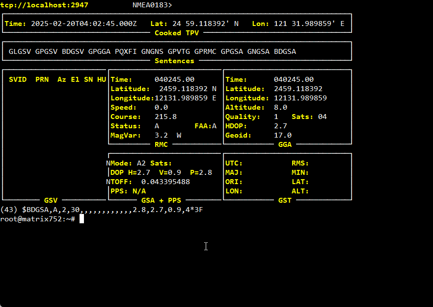

# Using GPS Mini PCIE Module

The Matrix-752U comes with a Mini PCIE slot which supports GPS module.

## SIMCom SIM7600-SA-H
### Following document for upgrade system and driver installation
- [Upgrade kernel](Using%20LTE-4G%20module.md#upgrde-the-kernel)
- [Driver installation](Using%20LTE-4G%20module.md#driver-installation)

### Start GPS session
```
cat /dev/ttyUSB2&
echo -ne "AT+CGPS=1\r" > /dev/ttyUSB2
```
### Get GPS status
```
echo -ne "AT+CGPS?\r" > /dev/ttyUSB2
```
#### Response
  ```
  +CGPS: <on_off>,<mode>
  ```
#### Defined Values
  ```
  <on_off>
  Values reserved by the present document:
  0 – stop GPS session
  1 – start GPS session
  
  <mode>
  1 – standalone mode
  2 – UE-based mode
  3 – UE-assisted mode
  ```

### Get realtime GPS information
```
cat /dev/ttyUSB1
```

### Get GPS fixed position
```
echo -ne "AT+CGNSSINFO\r" > /dev/ttyUSB2
```

### GPS daemon
#### install gpsd daemon and tools
```
apt install gpsd gpsd-tools
```

#### Configure device name in the /etc/default/gpsd file
```
DEVICES="/dev/ttyUSB1"
```

#### Check gpsd status
```
systemctl status gpsd
```

#### Monitor GPS real time data via command *gpsmon*


#### More detail following document from SIMCom official website
<https://www.simcom.com/technical_files.html>