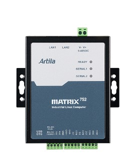

# Matrix-752 Hardware Guide

## 1. Overview

3. Pin Assignment and Definitions
3.1 Multi-function Reset Button
The Matrix-752 provides a multi-function reset button located on the side of the chassis as shown below:

The behavior of the reset button depends on how long you press the reset button.

| Press and hold the reset button | Behavior                                        | Network settings after reboot                     |
|---------------------------------|------------------------------------------------|--------------------------------------------------|
| < 3 seconds then release        | Re-boot the Matrix-752                         | Retains last user settings                       |
| 3~10 seconds then release       | Reset the network setting (The same setting as factory default) | eth0 IP: addr. by DHCP eth1 IP: 192.168.2.127 |
| > 10 seconds then release       | Restore and back to factory default. User’s data may disappear | eth0 IP: addr. by DHCP eth1 IP: 192.168.2.127 |
