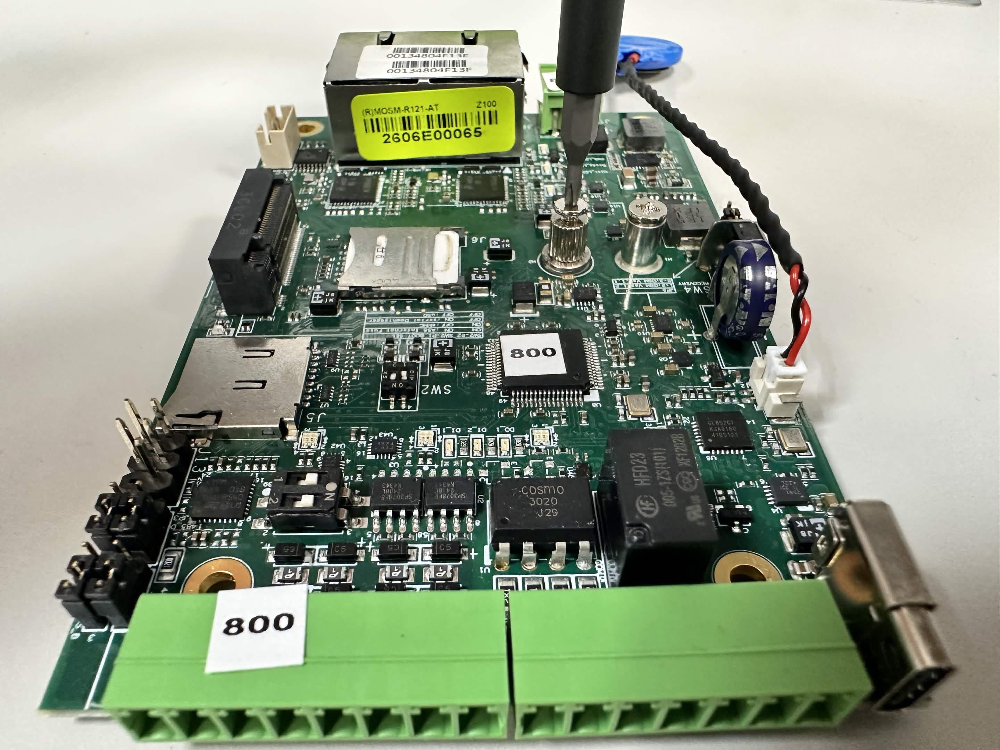
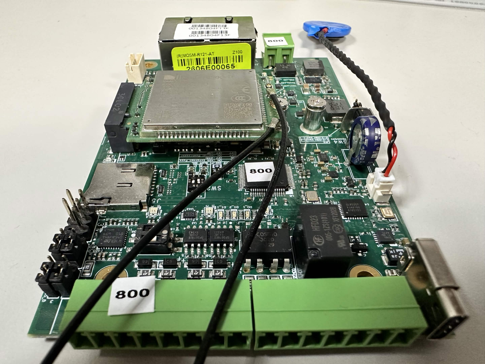

# LTE Module Guide

intro

## Hardware Requirements

- [Matrix-800](https://www.artila.com/en/products/linux-arm-industrial-box-computer/matrix-800) Industrial Box Computer
- [SIM7600X-H-M2](https://www.simcom.com/product/SIM7600X-H-M2.html) LTE Module
- Micro-SIM Card

## Hardware Guide

<p float="left">
    
    
</p>

1. Insert the Micro-SIM card into the Micro-SIM card socket.
2. Remove the screw next to the Micro-SIM card socket.
3. Attach the LTE module onto the M.2 connector.
4. Reinstall the screw to secure the LTE module.

## Software Guide

### Step 1 — Preparations

**Login as `root`**
```console
guest@matrix800:~$ su -
Password:
root@matrix800:~# 
```

**Install requireed packages**
```console
root@matrix800:~# apt -y install usbutils udhcpc
```

**Power on the M.2 module (wait until M.2 module blinks)**
```console
root@matrix800:~# gpioset gpiochip7 0=1
```

**Check module detection**
```console
root@matrix800:~# lsusb
Bus 001 Device 002: ID 1e0e:9001 Qualcomm / Option SimTech, Incorporated
```

### Step 2 — Dial-up

```bash
ifconfig wwan0 up
echo -e "AT\$QCRMCALL=1,1\r" > /dev/ttyUSB6
udhcpc -i wwan0
```
> [!NOTE]
> `ttyUSB6` is typically the correct port for the dial-up command. Try `ttyUSB5` or `ttyUSB7` if it doesn't respond.

### Step 3 — Verification

**Check IP address and status**
```bash
ip addr show wwan0
```

**Check default route**
```bash
ip route | grep default
```

**Test basic IP connectivity**
```bash
ping -I wwan0 8.8.8.8 -c 4
```

**Test DNS resolution**
```bash
ping -I wwan0 google.com -c 3
```