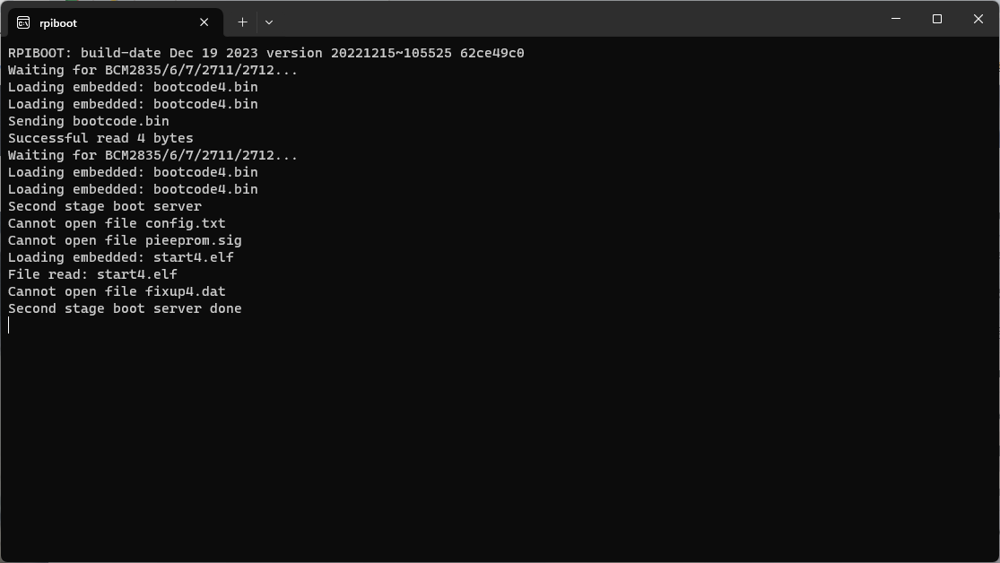
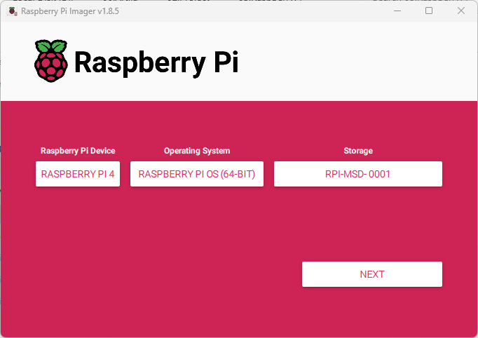
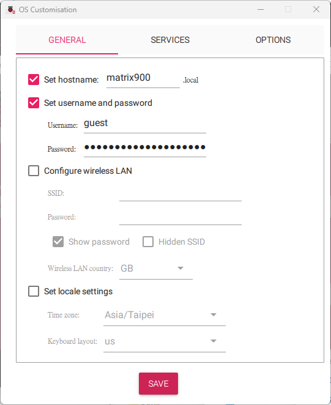
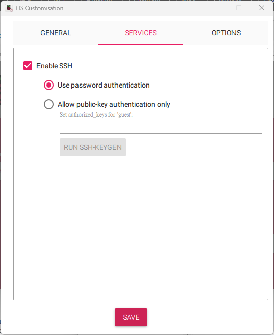
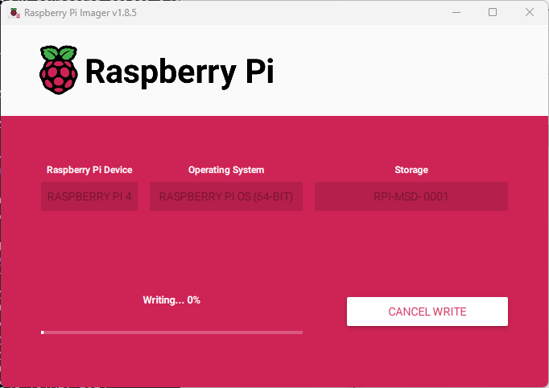
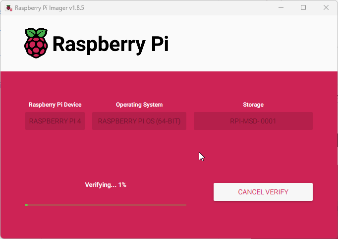
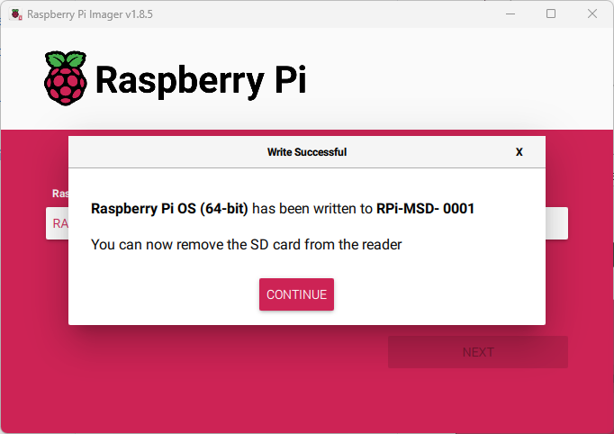

# Artila Matrix-900(CM4) Installation Guide

## Prepare required packages
### Download packages for the Matrix-900
  - Download RPIBoot from (https://github.com/raspberrypi/usbboot/raw/master/win32/rpiboot_setup.exe)
  - Download Raspberry Pi Imager from [Raspberry Pi OS](https://www.raspberrypi.com/software/)
    - Raspberry Pi OS(64-bit) with desktop
      ```
      Release date: July 4th 2024
      System: 64-bit
      Kernel version: 6.6
      Debian version: 12 (bookworm)
      Size: 1,142MB
      ```

### Install flash tools for the Matrix-900 on Windows
  - Install rpiboot_setup.exe
  - Install imager_1.8.5.exe

## Writing an image to the Matrix-900
  1. Set JP6 to 1-2 for RPI USB Device Boot
  2. Power-on Matrix-900
  3. Run rpiboot  
      
  
  4. Run Raspberry Pi Imager  
    - Raspberry Pi Device: RASPBERRY PI 4  
    - Operating System: Raspberry Pi OS(64-bit)  
    - Storage: RPI-MSD-0001  
      
  
  5. Select "NEXT"  
  6. If you want to customiz then select "EDIT SETTINGS"  
    - Customisation:  
      - Set hostname: matrix900  
      - Set username and password: guest/guest  
      - Enable SSH services  
      
      
    
  7. Start writing image to the eMMC  
      
    
  8. If you don't want to verify the installation, you can cancel the verification  
      
    
  9. Install finished  
      
    
  10. Set JP6 to 2-3 and restart Matrix-900  
  
  > :exclamation: Writing an image to the Matrix-900(16GB) eMMC Elapsed time: 19 minuts
