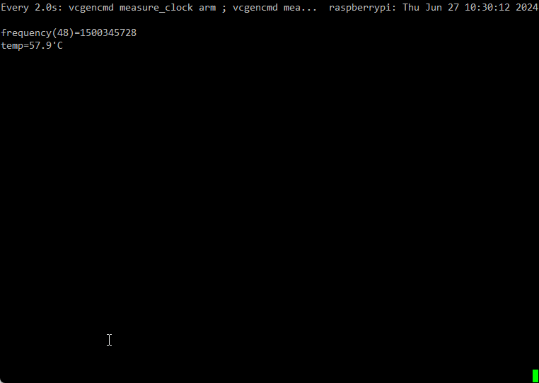
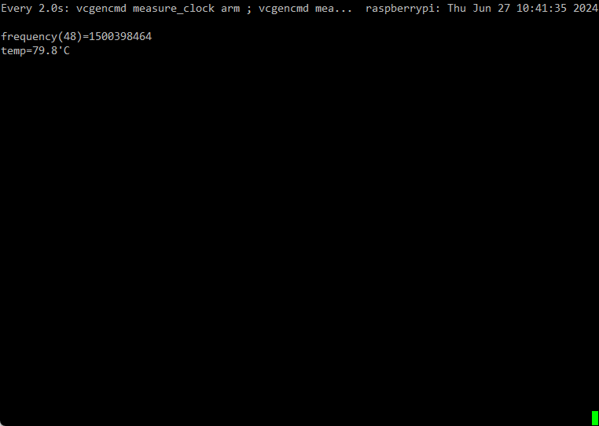
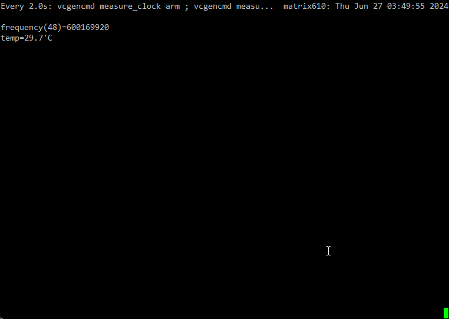
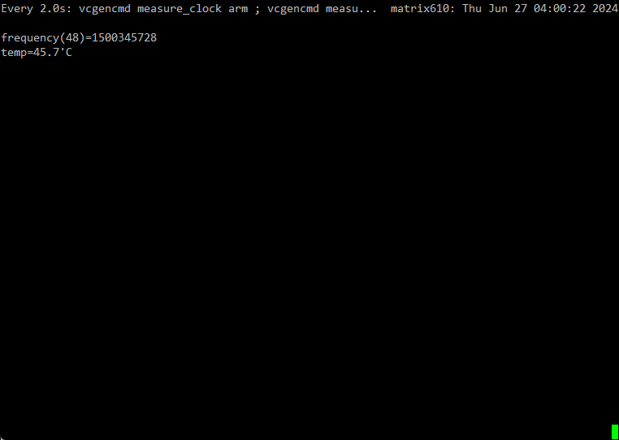

# Matrix-900 simple thermal test

## Test environment
- Artila office
- Matrix-900 A without heatsink
- Matrix-900 B with heatsink

## Result
- Matrix-900 A(without heatsink)
  - Before excute cpu load  
      
  - After excute cpu load 10 minutes  
      
- Matrix-900 B(with heatsink)
  - Before excute cpu load  
      
  - After excute cpu load 10 minutes  
      