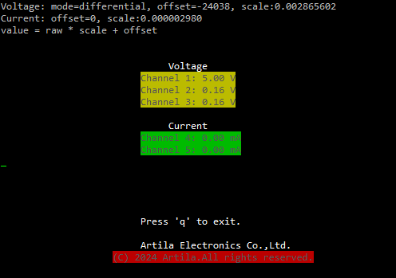
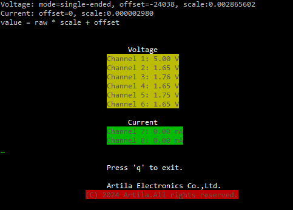
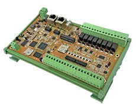
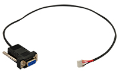
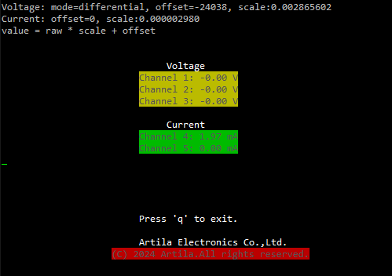
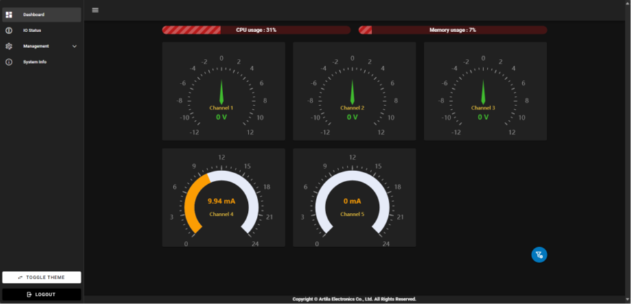
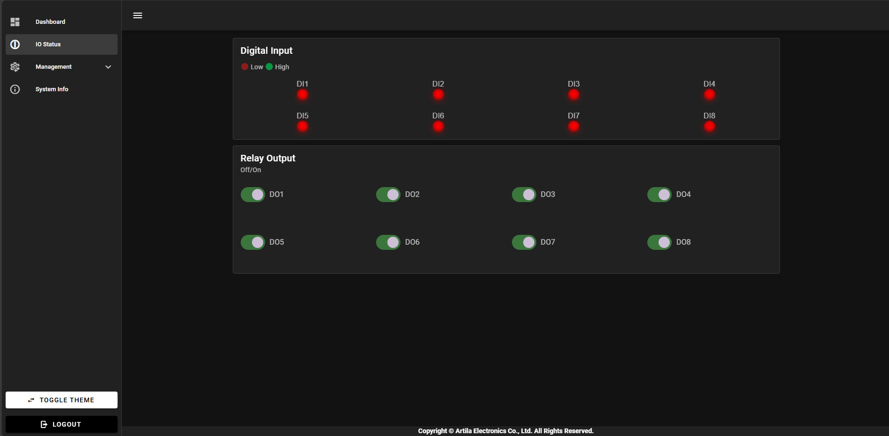
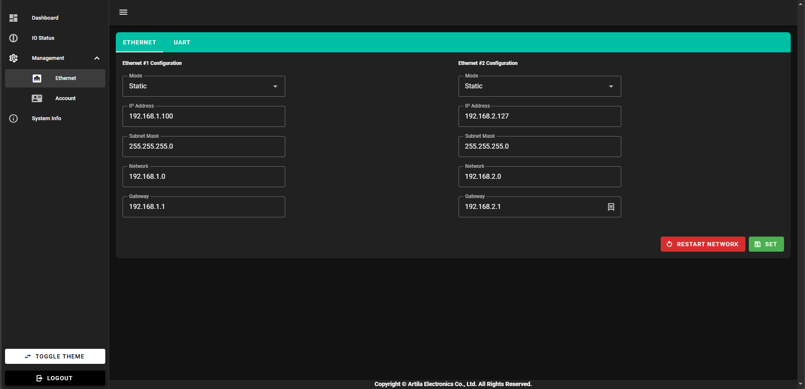

# PAC-6070 Software Guide

## Access Ethernet Ports
The PAC-6070 comes with two Ethernet ports, labeled as LAN1 and LAN2. By default, the IP address of LAN2 is 192.168.2.127 and the IP address of LAN1 is assigned by DHCP.

LAN1 is mapped to eth0 and LAN2 is mapped to eth1.

## SSH Connection via LAN2
Users need to configure their PC/Notebook's network settings properly to start an SSH connection via LAN2.

### Login with guest account
By default, the PAC-6070 is not allowed to login as a root account via SSH. You can login as a guest account. The default guest user name is guest and the password is guest.
```
$ ssh guest@192.168.2.127
guest@192.168.2.127's password: 
Welcome to Ubuntu 22.04.5 LTS (GNU/Linux 6.6.32 armv7l)

 * Documentation:  https://help.ubuntu.com
 * Management:     https://landscape.canonical.com
 * Support:        https://ubuntu.com/pro

This system has been minimized by removing packages and content that are
not required on a system that users do not log into.

To restore this content, you can run the 'unminimize' command.
Last login: Thu Jul 18 14:01:39 2024
guest@pac6070:~$
```

### Switch to root account
The root account user name is root and the passwword is root.

```
guest@pac6070:~$ su -
Password: 
root@pac6070:~#
```
## Basic System Information
### Check Linux Kernel Version
```
root@pac6070:~# uname -a
Linux pac6070 6.6.22 #1 Fri Mar 15 18:25:07 UTC 2024 armv7l armv7l armv7l GNU/Linux
```

### Check Ubuntu Version
```
root@pac6070:~# lsb_release -a
No LSB modules are available.
Distributor ID: Ubuntu
Description:    Ubuntu 22.04.4 LTS
Release:        22.04
Codename:       jammy
```  
### Check File System Information 
The PAC-6070 comes with 16GB on-board eMMC Flash memory, which contains boot loader, Linux kernel, root file system and user disk (/home).  
```
root@pac6070:~# lsblk
NAME         MAJ:MIN RM  SIZE RO TYPE MOUNTPOINTS
mmcblk1      179:0    0 14.6G  0 disk
tqmmcblk1p1  179:1    0    2G  0 part
mqmmcblk1p2  179:2    0 12.6G  0 part /
mmcblk1boot0 179:8    0    4M  1 disk
mmcblk1boot1 179:16   0    4M  1 disk

root@pac6070:~# df -h
Filesystem      Size  Used Avail Use% Mounted on
/dev/root        13G  1.1G   11G   9% /
tmpfs           502M     0  502M   0% /dev/shm
tmpfs           201M   21M  180M  11% /run
tmpfs           5.0M     0  5.0M   0% /run/lock
tmpfs           101M     0  101M   0% /run/user/0

root@pac6070:~# ls -F /
bin@   etc/   lib@         mnt/   root/  srv/      tmp/
boot/  gpio/  lost+found/  opt/   run/   swapfile  usr/
dev/   home/  media/       proc/  sbin@  sys/      var/
```
## Configure System Time
### Auto Synchronize with NTP Server
PAC-6070 supports `timedatectl` command to manage the Linux system time. By Default, the system time is synchronized with an NTP server.  

```
root@pac6070:~# timedatectl
               Local time: Thu 2024-07-18 13:47:56 CST
           Universal time: Thu 2024-07-18 05:47:56 UTC
                 RTC time: Thu 2024-07-18 05:47:56
                Time zone: Asia/Taipei (CST, +0800)
System clock synchronized: yes
              NTP service: active
          RTC in local TZ: no
```  
### Manually Set the System Time
If you want to manually set the system time, please follow the steps shown below: 
```
root@pac6070:~# timedatectl set-ntp no
root@pac6070:~# timedatectl set-time "2024-07-18 14:00:00"
root@pac6070:~# timedatectl
               Local time: Thu 2024-07-18 14:00:13 CST
           Universal time: Thu 2024-07-18 06:00:13 UTC
                 RTC time: Thu 2024-07-18 06:00:13
                Time zone: Asia/Taipei (CST, +0800)
System clock synchronized: no
              NTP service: inactive
          RTC in local TZ: no
```

## Access Digital I/O  
### DIO Mapping
The PAC-6070 comes with 8x opto-isolated digital inputs and 8x relay digital outputs. Below is the DIO mapping table:

|DI Number|Device Mapping|DO Number|Device Mapping|
|---|---|--|---|
|DI1|/gpio/DI1|DO1|/gpio/DO1|
|DI2|/gpio/DI2|DO2|/gpio/DO2|
|DI3|/gpio/DI3|DO3|/gpio/DO3|
|DI4|/gpio/DI4|DO4|/gpio/DO4|
|DI5|/gpio/DI5|DO5|/gpio/DO5|
|DI6|/gpio/DI6|DO6|/gpio/DO6|
|DI7|/gpio/DI7|DO7|/gpio/DO7|
|DI8|/gpio/DI8|DO8|/gpio/DO8|

```
root@pac6070:~# ls /gpio/
DI1  DI3  DI5  DI7  DO1  DO3  DO5  DO7  pciepower
DI2  DI4  DI6  DI8  DO2  DO4  DO6  DO8
```

### Read Digital Input
Example: read value of DI1  
```
root@pac6070:~# cat /gpio/DI1/value  
```
### Write Digital Output
Example: 
If DO1 relay is at NO (normally open) mode, the following command will let the relay close.
```  
root@pac6070:~# echo 1 > /gpio/DO1/value
```
Example: If DO1 relay is at NO (normally open) mode, the following command will let the relay open.
```  
root@pac6070:~# echo 0 > /gpio/DO1/value
```
## Access Analog Input
The PAC-6070 can measure voltage input (-10Vdc ~ +10Vdc) or current input (0mA ~ 20mA). 


### Voltage Input Wiring
Users can find voltage input terminals labeled as V1+, V1-, V2+, V2-, V3+, V3- and AGND. 

### Voltage Input Mode Setting
The voltage input supports differential mode or single-end mode.
User can modify **/etc/modprobe.d/ad4111.conf** file to set the voltage input mode.
```
options ad4111 differential=1
or
options ad4111 differential=0
```
differential=1 means differential mode.
differential=0 means single-end mode.

If the voltage input mode is changed, please reboot the system to activate the new settings.
```
root@pac6070:~# reboot
```

### Differential Input Channels
For differential voltage input, the first channel is V1+ and V1-, the second channel is V2+ and V2-, the third channel is V3+ and V3-. 
|Differential Channel|Terminals|
|---|---|
|CH1|V1+ and V1-|
|CH2|V2+ and V2-| 
|CH3|V3+ and V3-|

### Differential Input Calculation
The file paths of the voltage inputs are located in /sys/bus/iio/devices/iio:device0/

|Channel|Raw Value Path|Offset Value Path|
|---|---|---|
|CH1|in_voltage0_voltage1_raw|in_voltage0_voltage1_offset|
|CH2|in_voltage2_voltage3_raw|in_voltage2_voltage3_offset|
|CH3|in_voltage4_voltage5_raw|in_voltage4_voltage5_offset|

In the same directory, there is an **in_voltage_voltage_scale** file stores the scale value which needs to multiply with raw data to get the voltage value.

The common formula to calculate the voltage is:
```
voltage = (raw * scale) + offset
```

Below are the formulas to calculate the voltage value of each channel:
```
CH1_voltage = (in_voltage0_voltage1_raw * in_voltage_voltage_scale) + in_voltage0_voltage1_offset

CH2_voltage = (in_voltage2_voltage3_raw * in_voltage_voltage_scale) + in_voltage2_voltage3_offset

CH3_voltage = (in_voltage4_voltage5_raw * in_voltage_voltage_scale) + in_voltage4_voltage5_offset
```

### Single-end Input Channels
For single-end voltage input, the first channel is V1+ and AGND, the second channel is V1- and AGND, and so on, please refer to the following table:

|Single-end Channel|Terminals|
|---|---|
|CH1|V1+ and AGND|
|CH2|V1- and AGND|
|CH3|V2+ and AGND|
|CH4|V2- and AGND|
|CH5|V3+ and AGND|
|CH6|V3- and AGND|

### Single-end Input Calculation
The file paths of the voltage inputs are located in /sys/bus/iio/devices/iio:device0/

|Channel|Raw Value Path|Offset Value Path|
|---|---|---|
|CH1|in_voltage0_raw|in_voltage0_offset|
|CH2|in_voltage1_raw|in_voltage1_offset|
|CH3|in_voltage2_raw|in_voltage2_offset|
|CH4|in_voltage3_raw|in_voltage3_offset|
|CH5|in_voltage4_raw|in_voltage4_offset|
|CH6|in_voltage5_raw|in_voltage5_offset|

In the same directory, there is an **in_voltage_voltage_scale** file stores the scale value which needs to multiply with raw data to get the voltage value.

The common formula to calculate the voltage is:
```
voltage = (raw * scale) + offset
```

Below are the formulas to calculate the voltage value of each channel:
```
CH1_voltage = (in_voltage0_raw * in_voltage_voltage_scale) + in_voltage0_offset

CH2_voltage = (in_voltage1_raw * in_voltage_voltage_scale) + in_voltage1_offset

CH3_voltage = (in_voltage2_raw * in_voltage_voltage_scale) + in_voltage2_offset

CH4_voltage = (in_voltage3_raw * in_voltage_voltage_scale) + in_voltage3_offset

CH5_voltage = (in_voltage4_raw * in_voltage_voltage_scale) + in_voltage4_offset

CH6_voltage = (in_voltage5_raw * in_voltage_voltage_scale) + in_voltage5_offset
```

### Current Input Wiring
Users can find current input terminals labeled as AI1, AI2 and AGND.

### Current Input Channels
|Current Channel|Terminals|
|---|---|
|CH1|AI1 and AGND|
|CH2|AI2 and AGND|

### Current Input Calculation
The file paths of the current inputs are located in /sys/bus/iio/devices/iio:device0/

|Channel|Raw Value Path|Offset Value Path|
|---|---|---|
|CH1|in_current0_raw|in_current0_offset|
|CH2|in_current1_raw|in_current1_offset|

In the same directory, there is an **in_current_current_scale** file stores the scale value which needs to multiply with raw data to get the current value.

The common formula to calculate the current is:
```
current = (raw * scale) + offset
```

Below are the formulas to calculate the current value of each channel:
```
CH1_current = (in_current0_raw * in_current_current_scale) + in_current0_offset

CH2_current = (in_current1_raw * in_current_current_scale) + in_current1_offset
```

### Analog Input Utility
The PAC-6070 provides an utility **lsadc** to read the analog input values.
```
root@pac6070:~# lsadc
```
The following are the screenshots of the **lsadc** utility.

- Differential mode
 

- Single-end mode       
 


## Access the USB Serial Console
### Serial Console Log-in
User name: root  
Password: root  
|PAC-6070 comes with a<br>4 pin wafer box female|Wafer box to DB9 Female Console Cable|Desktop/Notebook PC with a <br>USB to DB9 RS232 Converter Cable|
|:--:|:--:|:--:|
||||

Following example by PAC-6070
```
Ubuntu 22.04.4 LTS pac6070 ttymxc0

pac6070 login: root
Password:
Welcome to Ubuntu 22.04.4 LTS (GNU/Linux 6.6.22 armv7l)

 * Documentation:  https://help.ubuntu.com
 * Management:     https://landscape.canonical.com
 * Support:        https://ubuntu.com/pro

This system has been minimized by removing packages and content that are
not required on a system that users do not log into.

To restore this content, you can run the 'unminimize' command.
Last login: Wed Nov 22 04:57:55 CST 2023 on ttymxc0
root@pac6070:~#
```

## Network Settings
### Config the Network Interface
PAC-6070 come two Ethernet ports, the default network settings are shown below:  
|Ethernet Type|Port Label|Device mapping|IP mode|IP address|
|---|---|---|---|---|
|10/100Mbit|LAN|eth0|DHCP|auto|
|10/100Mbit|LAN|eth1|static|192.168.2.127|  

Users may need to modify the network settings to meet their LAN environment. The network interface configuration file path is /etc/network/interfaces. Edit and save the configuration file, then use `systemctl restart NetworkManager` command to restart the network interface to activate the network settings.  

Default network settings are shown below:
```
root@pac6070:~# cat /etc/network/interfaces
# /etc/network/interfaces -- configuration file for ifup(8), ifdown(8)

... ...

auto eth0
    iface eth0 inet dhcp
    #    address 192.168.1.100
    #    netmask 255.255.255.0
    #    network 192.168.1.0
    #    gateway 192.168.1.1

auto eth1
    iface eth1 inet static
        address 192.168.2.127
        netmask 255.255.255.0
        network 192.168.2.0
        gateway 192.168.2.1
        
... ...
```  
Set the IP address of eth0 to static IP address.  
```
root@pac6070:~# cat /etc/network/interfaces
# /etc/network/interfaces -- configuration file for ifup(8), ifdown(8)

... ...

auto eth0
    iface eth0 inet static
    address 192.168.1.100
    netmask 255.255.255.0
    network 192.168.1.0
    gateway 192.168.1.1
    dns-nameservers 192.168.1.1

auto eth1
    iface eth1 inet static
        address 192.168.2.127
        netmask 255.255.255.0
        network 192.168.2.0
        gateway 192.168.2.1

... ...
```
Restart the network interface to activate the network settings.  
```
root@pac6070:~# systemctl restart NetworkManager
root@pac6070:~# ifconfig eth0 down && ifconfig eth0 up
root@pac6070:~# ip a show eth0
2: eth0: <BROADCAST,MULTICAST,UP,LOWER_UP> mtu 1500 qdisc pfifo_fast state UP group default qlen 1000
    link/ether 00:13:48:00:00:00 brd ff:ff:ff:ff:ff:ff
    inet 192.168.1.100/24 brd 192.168.1.255 scope global noprefixroute eth0
       valid_lft forever preferred_lft forever
    inet6 fe80::7bea:679b:7e44:3b1b/64 scope link tentative noprefixroute
       valid_lft forever preferred_lft forever
```

### Configure the DNS Server
Use `resolvectl` to set the DNS server.  
`resolvectl dns eth0 8.8.8.8`  

Check the DNS service status.
```
root@pac6070:~# systemctl status systemd-resolved
● systemd-resolved.service - Network Name Resolution
     Loaded: loaded (/lib/systemd/system/systemd-resolved.service; enabled; vend
or preset: enabled)
     Active: active (running) since Wed 2023-11-22 04:57:31 CST; 7 mo
nths 16 days ago
       Docs: man:systemd-resolved.service(8)
             man:org.freedesktop.resolve1(5)
             https://www.freedesktop.org/wiki/Software/systemd/writing-network-c
onfiguration-managers
             https://www.freedesktop.org/wiki/Software/systemd/writing-resolver-
clients
   Main PID: 92 (systemd-resolve)
     Status: "Processing requests..."
        CPU: 3.006s
     CGroup: /system.slice/systemd-resolved.service
             mq92 /lib/systemd/systemd-resolved

Jul 08 15:08:21 pac6070 systemd-resolved[92]:
Using degraded feature set UDP instead of UDP+EDNS0 for DNS server 192.168.1.1
.
Jul 08 16:10:53 pac6070 systemd-resolved[92]: eth0: Bus client set DNS server li
st to: 8.8.8.8
Notice: journal has been rotated since unit was started, output may be incomplet
e.
```  
***Notice***  
Using resolvectl to set the DNS will be ineffective after system reboot.  
## Access the SSH Console   
### guest account
Default is allowed to login as guest account via SSH in Ubuntu 22.04.  
```
User name: guest  
Password: guest  
```
Login with guest account via SSH.  
```
[root@Matrix_034060 ~]#ssh guest@192.168.1.100
guest@192.168.1.100's password:
Welcome to Ubuntu 22.04.4 LTS (GNU/Linux 6.6.32 armv7l)

 * Documentation:  https://help.ubuntu.com
 * Management:     https://landscape.canonical.com
 * Support:        https://ubuntu.com/pro

This system has been minimized by removing packages and content that are
not required on a system that users do not log into.

To restore this content, you can run the 'unminimize' command.
Last login: Mon Jul 15 17:26:48 2024 from 192.168.1.74
guest@pac6070:~$
```
### root account
Default is not allowed to login as root account via SSH in Ubuntu 22.04. To enable the root account login via SSH, modify the **sshd_config** file.  
 - `vi /etc/ssh/sshd_config`, find the line `PermitRootLogin prohibit-password` and change it to `PermitRootLogin yes`.  
 - `systemctl restart sshd` to restart the SSH service.


## Serial Port Settings
### Port Mapping 
|Port Number|Device Mapping|
|---|---|
|1|/dev/ttymxc1|
### Configure the Serial Port
PAC-6070 only come with 1 RS-485 port. The default serial port settings are shown below:  
```
root@pac6070:~# setuart -p1
Port 1 ==> type: RS485
baud: 115200
```
If you need to modify the serial port settings, use the `setuart` command.
```
root@pac6070:~# setuart -h
Artila utility: setuart
Usage: setuart [OPTION]

 -h         display this help and exit
 -v         print version number and exit
 -p         uart port number
 -t         uart interface type [232, 485]
 -b         set baud rate, up to 921600bps

Examples:
  setuart -p 1                      display port 1 type and baud rate
  setuart -p 1 -t 485 -b 115200     set port 1 type RS-485 and baud rate to 115200
  setuart -p 1 -t 232 -b 9600       set port 1 type to RS-232 and baud rate to 9600
```
***Caution***  
The serial port’s mode and associated communication parameters will go back to factory default after system reboot.  


## Software Package Management
Using apt commands are listed below:
- `apt install <package>` to install package
- `apt remove <package>` to remove package
- `apt search <package>` to search package
- `apt update` to update the package list
- `apt upgrade` to upgrade installed packages

## Mount/Unmount an SD Card
The Cortex-A7 Series based Matrix IoT gateways support SD card access. If an SD card is inserted, you can use `lsblk` command to find the device identifier name. And then use `mount` command to mount the SD card to a folder.  

Before SD Insertion
```
root@pac6070:~# lsblk
NAME         MAJ:MIN RM  SIZE RO TYPE MOUNTPOINTS
mmcblk1      179:0    0 14.6G  0 disk
`-mmcblk1p1  179:1    0    2G  0 part
 -mmcblk1p2  179:2    0 12.6G  0 part /
mmcblk1boot0 179:8    0    4M  1 disk
mmcblk1boot1 179:16   0    4M  1 disk
```  
After SD Insertion
```
root@pac6070:~# lsblk
NAME         MAJ:MIN RM  SIZE RO TYPE MOUNTPOINTS
mmcblk1      179:0    0 14.6G  0 disk
`-mmcblk1p1  179:1    0    2G  0 part
 -mmcblk1p2  179:2    0 12.6G  0 part /
mmcblk1boot0 179:8    0    4M  1 disk
mmcblk1boot1 179:16   0    4M  1 disk
mmcblk0      179:24   0  7.3G  0 disk
`-mmcblk0p1  179:25   0  7.3G  0 part
```  
Mount mmcblk1 to /media.  
```
root@pac6070:~# mount /dev/mmcblk0p1 /media/
root@pac6070:~# lsblk
NAME         MAJ:MIN RM  SIZE RO TYPE MOUNTPOINTS
mmcblk1      179:0    0 14.6G  0 disk
`-mmcblk1p1  179:1    0    2G  0 part
 -mmcblk1p2  179:2    0 12.6G  0 part /
mmcblk1boot0 179:8    0    4M  1 disk
mmcblk1boot1 179:16   0    4M  1 disk
mmcblk0      179:24   0  7.3G  0 disk
`-mmcblk0p1  179:25   0  7.3G  0 part /media
```  
Unmount /media.
```
root@pac6070:~# umount /media/
```  

## Reboot the System
To re-boot the system, use the `reboot` command.  

## DIO  
### DIO Mapping  
|DI Number|Device Mapping|DO Number|Device Mapping|
|---|---|--|---|
|DI1|/gpio/DI1|DO1|/gpio/DO1|
|DI2|/gpio/DI2|DO2|/gpio/DO2|
|DI3|/gpio/DI3|DO3|/gpio/DO3|
|DI4|/gpio/DI4|DO4|/gpio/DO4|
|DI5|/gpio/DI5|DO5|/gpio/DO5|
|DI6|/gpio/DI6|DO6|/gpio/DO6|
|DI7|/gpio/DI7|DO7|/gpio/DO7|
|DI8|/gpio/DI8|DO8|/gpio/DO8|

### Read/Write DIO
```
root@pac6070:~# ls /gpio/
DI1  DI3  DI5  DI7  DO1  DO3  DO5  DO7  pciepower
DI2  DI4  DI6  DI8  DO2  DO4  DO6  DO8
```  
Example 1, Read value of DI1  
`cat /gpio/DI1/value`  

Example 2, Set High of DO1  
`echo 0 > /gpio/DO1/value`  

## Setup SIM card
### PCIE Power
PCIE power value is 1 means power on, 0 means power off.
```
root@pac6070:~# cat /gpio/pciepower/value
1
```  
Power off the PCIE slot.  
```
echo 0 > /gpio/pciepower/value  
```

PAC-6070 support the miniPCIe slot can be install LTE/4G module for communication.
SIM Card setting is necessary before access by following:  
==***NOTICE***==: Please unlock SIM PIN code first  
Example: SIM7100E  
`apt install -y kernel-module-option kernel-module-qmi-wwan kernel-module-cdc-wdm kernel-module-usbnet libqmi-utils`  
`apt install usbutils -y`  
`apt install picocom -y`
```
root@pac6070:~# usb-devices

T:  Bus=01 Lev=00 Prnt=00 Port=00 Cnt=00 Dev#=  1 Spd=480 MxCh= 1
D:  Ver= 2.00 Cls=09(hub  ) Sub=00 Prot=01 MxPS=64 #Cfgs=  1
P:  Vendor=1d6b ProdID=0002 Rev=06.06
S:  Manufacturer=Linux 6.6.22 ehci_hcd
S:  Product=EHCI Host Controller
S:  SerialNumber=ci_hdrc.0
C:  #Ifs= 1 Cfg#= 1 Atr=e0 MxPwr=0mA
I:  If#= 0 Alt= 0 #EPs= 1 Cls=09(hub  ) Sub=00 Prot=00 Driver=hub
E:  Ad=81(I) Atr=03(Int.) MxPS=   4 Ivl=256ms

T:  Bus=02 Lev=00 Prnt=00 Port=00 Cnt=00 Dev#=  1 Spd=480 MxCh= 1
D:  Ver= 2.00 Cls=09(hub  ) Sub=00 Prot=01 MxPS=64 #Cfgs=  1
P:  Vendor=1d6b ProdID=0002 Rev=06.06
S:  Manufacturer=Linux 6.6.22 ehci_hcd
S:  Product=EHCI Host Controller
S:  SerialNumber=ci_hdrc.1
C:  #Ifs= 1 Cfg#= 1 Atr=e0 MxPwr=0mA
I:  If#= 0 Alt= 0 #EPs= 1 Cls=09(hub  ) Sub=00 Prot=00 Driver=hub
E:  Ad=81(I) Atr=03(Int.) MxPS=   4 Ivl=256ms

T:  Bus=02 Lev=01 Prnt=01 Port=00 Cnt=01 Dev#=  2 Spd=480 MxCh= 0
D:  Ver= 2.00 Cls=00(>ifc ) Sub=00 Prot=00 MxPS=64 #Cfgs=  2
P:  Vendor=1e0e ProdID=9001 Rev=02.32
S:  Manufacturer=SimTech, Incorporated
S:  Product=SimTech, Incorporated
S:  SerialNumber=0123456789ABCDEF
C:  #Ifs= 7 Cfg#= 1 Atr=80 MxPwr=500mA
I:  If#= 0 Alt= 0 #EPs= 2 Cls=ff(vend.) Sub=ff Prot=ff Driver=(none)
E:  Ad=01(O) Atr=02(Bulk) MxPS= 512 Ivl=0ms
E:  Ad=81(I) Atr=02(Bulk) MxPS= 512 Ivl=0ms
I:  If#= 1 Alt= 0 #EPs= 3 Cls=ff(vend.) Sub=00 Prot=00 Driver=(none)
E:  Ad=02(O) Atr=02(Bulk) MxPS= 512 Ivl=0ms
E:  Ad=82(I) Atr=02(Bulk) MxPS= 512 Ivl=0ms
E:  Ad=83(I) Atr=03(Int.) MxPS=  10 Ivl=32ms
I:  If#= 2 Alt= 0 #EPs= 3 Cls=ff(vend.) Sub=00 Prot=00 Driver=(none)
E:  Ad=03(O) Atr=02(Bulk) MxPS= 512 Ivl=0ms
E:  Ad=84(I) Atr=02(Bulk) MxPS= 512 Ivl=0ms
E:  Ad=85(I) Atr=03(Int.) MxPS=  10 Ivl=32ms
I:  If#= 3 Alt= 0 #EPs= 3 Cls=ff(vend.) Sub=00 Prot=00 Driver=(none)
E:  Ad=04(O) Atr=02(Bulk) MxPS= 512 Ivl=0ms
E:  Ad=86(I) Atr=02(Bulk) MxPS= 512 Ivl=0ms
E:  Ad=87(I) Atr=03(Int.) MxPS=  10 Ivl=32ms
I:  If#= 4 Alt= 0 #EPs= 3 Cls=ff(vend.) Sub=00 Prot=00 Driver=(none)
E:  Ad=05(O) Atr=02(Bulk) MxPS= 512 Ivl=0ms
E:  Ad=88(I) Atr=02(Bulk) MxPS= 512 Ivl=0ms
E:  Ad=89(I) Atr=03(Int.) MxPS=  10 Ivl=32ms
I:  If#= 5 Alt= 0 #EPs= 3 Cls=ff(vend.) Sub=ff Prot=ff Driver=(none)
E:  Ad=06(O) Atr=02(Bulk) MxPS= 512 Ivl=0ms
E:  Ad=8a(I) Atr=02(Bulk) MxPS= 512 Ivl=0ms
E:  Ad=8b(I) Atr=03(Int.) MxPS=   8 Ivl=32ms
I:  If#= 6 Alt= 0 #EPs= 2 Cls=ff(vend.) Sub=42 Prot=01 Driver=(none)
E:  Ad=07(O) Atr=02(Bulk) MxPS= 512 Ivl=0ms
E:  Ad=8c(I) Atr=02(Bulk) MxPS= 512 Ivl=0ms
```  
```
root@pac6070:~# lsusb
Bus 002 Device 002: ID 1e0e:9001 Qualcomm / Option SimTech, Incorporated
Bus 002 Device 001: ID 1d6b:0002 Linux Foundation 2.0 root hub
Bus 001 Device 001: ID 1d6b:0002 Linux Foundation 2.0 root hub
```  
```
root@pac6070:~# mmcli -L
    /org/freedesktop/ModemManager1/Modem/0 [QUALCOMM INCORPORATED] 0
root@pac6070:~# mmcli -m 0
  ----------------------------------
  General  |                   path: /org/freedesktop/ModemManager1/Modem/0
           |              device id: a7f45606e1fd59c56e6e1d64bf0e145bcf421214
  ----------------------------------
  Hardware |           manufacturer: QUALCOMM INCORPORATED
           |                  model: 0
           |      firmware revision: M9615A-CETWTBZM-6.0.15255  1  [Mar 04 2015 07:00:00]
           |           h/w revision: 30000
           |              supported: gsm-umts, lte
           |                current: gsm-umts, lte
           |           equipment id: 866802020119147
  ----------------------------------
  System   |                 device: /sys/devices/platform/soc/2100000.bus/2184200.usb/ci_hdrc.1/usb2/2-1
           |                drivers: qmi_wwan, option
           |                 plugin: simtech
           |           primary port: cdc-wdm0
           |                  ports: cdc-wdm0 (qmi), ttyUSB0 (ignored), ttyUSB1 (gps),
           |                         ttyUSB2 (at), ttyUSB3 (at), ttyUSB4 (audio), wwan0 (net)
  ----------------------------------
  Status   |                   lock: sim-pin2
           |         unlock retries: sim-pin (3), sim-puk (10), sim-pin2 (3), sim-puk2 (10)
           |                  state: searching
           |            power state: on
           |         signal quality: 33% (recent)
  ----------------------------------
  Modes    |              supported: allowed: 2g; preferred: none
           |                         allowed: 3g; preferred: none
           |                         allowed: 4g; preferred: none
           |                         allowed: 2g, 3g; preferred: 3g
           |                         allowed: 2g, 3g; preferred: 2g
           |                         allowed: 2g, 4g; preferred: 4g
           |                         allowed: 2g, 4g; preferred: 2g
           |                         allowed: 3g, 4g; preferred: 4g
           |                         allowed: 3g, 4g; preferred: 3g
           |                         allowed: 2g, 3g, 4g; preferred: 4g
           |                         allowed: 2g, 3g, 4g; preferred: 3g
           |                         allowed: 2g, 3g, 4g; preferred: 2g
           |                current: allowed: 2g, 3g, 4g; preferred: 4g
  ----------------------------------
  Bands    |              supported: egsm, dcs, utran-1, utran-3, utran-5, utran-8, eutran-1,
           |                         eutran-3, eutran-7, eutran-8, eutran-20, eutran-38, eutran-40
           |                current: egsm, dcs, utran-1, utran-8, eutran-1, eutran-3, eutran-7,
           |                         eutran-8, eutran-20, eutran-38, eutran-40
  ----------------------------------
  IP       |              supported: ipv4, ipv6, ipv4v6
  ----------------------------------
  3GPP     |                   imei: 866802020119147
           |          enabled locks: fixed-dialing
           |           registration: searching
           |   packet service state: detached
  ----------------------------------
  3GPP EPS |   ue mode of operation: csps-2
           | initial bearer ip type: ipv4v6
  ----------------------------------
  SIM      |       primary sim path: /org/freedesktop/ModemManager1/SIM/0
  ```  
  ```
  root@pac6070:~# picocom /dev/ttyUSB2
picocom v3.1

port is        : /dev/ttyUSB2
flowcontrol    : none
baudrate is    : 9600
parity is      : none
databits are   : 8
stopbits are   : 1
escape is      : C-a
local echo is  : no
noinit is      : no
noreset is     : no
hangup is      : no
nolock is      : no
send_cmd is    : sz -vv
receive_cmd is : rz -vv -E
imap is        :
omap is        :
emap is        : crcrlf,delbs,
logfile is     : none
initstring     : none
exit_after is  : not set
exit is        : no

Type [C-a] [C-h] to see available commands
Terminal ready

*** local echo: yes ***
AT+CPIN?

+CPIN: READY

OK

Terminating...
Skipping tty reset...
Thanks for using picocom
```


## Setup analog input
### Overview
Voltage
- Mode: Differential (Default)
	- Channel 1: Voltage0-Voltage1
	- Channel 2: Voltage2-Voltage3
	- Channel 3: Voltage4-Voltage5
- Mode: Single-end
	- Channel 1: Voltage0
	- Channel 2: Voltage1
	- Channel 3: Voltage2
	- Channel 4: Voltage3
	- Channel 5: Voltage4
	- Channel 6: Voltage5

Current
- Channel 1: Current0
- Channel 2: Current1  
  
Path
- /sys/bus/iio/devices/iio:device0/  

Formula
- raw * scale + offset  

***Caution***  
Always ensure that test objects are properly connected to the analog input channels to avoid unstable and floating readings.  
If the channel is not connected to any test object. These readings should be ignored as they do not represent valid physical measurements.

### Voltage  
#### How To Change Mode  
- Differential=1 (Default)
- Single-end=0
```
root@pac6070:~# cat /etc/modprobe.d/ad4111.conf
options ad4111 differential=1
```
reboot after modify the config file.

#### Differential Mode
***Example - Apply a 5V voltage to the V1+ and V1- terminals of the analog input:***  
```
root@pac6070:/sys/bus/iio/devices/iio:device0# ls
buffer              in_current1_raw                     in_voltage0-voltage1_raw     of_node                       trigger
buffer0             in_current_scale                    in_voltage2-voltage3_offset  power                         uevent
dev                 in_current_scale_available          in_voltage2-voltage3_raw     sampling_frequency            waiting_for_supplier
in_current0_offset  in_voltage-voltage_scale            in_voltage4-voltage5_offset  sampling_frequency_available
in_current0_raw     in_voltage-voltage_scale_available  in_voltage4-voltage5_raw     scan_elements
in_current1_offset  in_voltage0-voltage1_offset         name                         subsystem
```  
```
root@pac6070:/sys/bus/iio/devices/iio:device0# cat in_voltage0-voltage1_raw
10132696
root@pac6070:/sys/bus/iio/devices/iio:device0# cat in_voltage0-voltage1_offset
-24038
root@pac6070:/sys/bus/iio/devices/iio:device0# cat in_voltage-voltage_scale
0.002865602
```  
$10132696 \times 0.002865602 - 24038 = 4998.27392299mV ≈ 5V$

Display - CLI `lsadc`  


Dump the IIO attributes `iio_info`
```
root@pac6070:/sys/bus/iio/devices/iio:device0# iio_info
Library version: 0.23 (git tag: v0.23)
Compiled with backends: local xml ip usb
IIO context created with local backend.
Backend version: 0.23 (git tag: v0.23)
Backend description string: Linux pac6070 6.6.32 #1 Sat May 25 14:22:56 UTC 2024 armv7l
IIO context has 2 attributes:
        local,kernel: 6.6.32
        uri: local:
IIO context has 2 devices:
        iio:device0: ad4111 (buffer capable)
                5 channels found:
                        voltage0-voltage1:  (input, index: 0, format: be:u24/32>>0)
                        4 channel-specific attributes found:
                                attr  0: offset value: -24038
                                attr  1: raw value: 10132703
                                attr  2: scale value: 0.002865602
                                attr  3: scale_available value: 0.000000000
                        voltage2-voltage3:  (input, index: 1, format: be:u24/32>>0)
                        4 channel-specific attributes found:
                                attr  0: offset value: -24038
                                attr  1: raw value: 8443036
                                attr  2: scale value: 0.002865602
                                attr  3: scale_available value: 0.000000000
                        voltage4-voltage5:  (input, index: 2, format: be:u24/32>>0)
                        4 channel-specific attributes found:
                                attr  0: offset value: -24038
                                attr  1: raw value: 8442532
                                attr  2: scale value: 0.002865602
                                attr  3: scale_available value: 0.000000000
                        current0:  (input, index: 3, format: be:u24/32>>0)
                        4 channel-specific attributes found:
                                attr  0: offset value: 0
                                attr  1: raw value: 0
                                attr  2: scale value: 0.000002980
                                attr  3: scale_available value: 0.000000000
                        current1:  (input, index: 4, format: be:u24/32>>0)
                        4 channel-specific attributes found:
                                attr  0: offset value: 0
                                attr  1: raw value: 0
                                attr  2: scale value: 0.000002980
                                attr  3: scale_available value: 0.000000000
                3 device-specific attributes found:
                                attr  0: sampling_frequency value: 31250
                                attr  1: sampling_frequency_available value: 31250 31250 31250 31250 31250 31250 15625 10417 5208
                                attr  2: waiting_for_supplier value: 0
                3 buffer-specific attributes found:
                                attr  0: data_available value: 0
                                attr  1: direction value: in
                                attr  2: watermark value: 1
                Current trigger: trigger0(ad4111-dev0)
        trigger0: ad4111-dev0
                0 channels found:
                No trigger on this device
``` 

#### Single End Mode
***Example - Apply a 5V voltage to the V1+ and AGND terminals of the analog input:***  
```
root@pac6070:/sys/bus/iio/devices/iio:device0# ls
buffer              in_current1_raw             in_voltage1_raw     in_voltage4_raw             of_node                       trigger
buffer0             in_current_scale            in_voltage2_offset  in_voltage5_offset          power                         uevent
dev                 in_current_scale_available  in_voltage2_raw     in_voltage5_raw             sampling_frequency            waiting_for_supplier
in_current0_offset  in_voltage0_offset          in_voltage3_offset  in_voltage_scale            sampling_frequency_available
in_current0_raw     in_voltage0_raw             in_voltage3_raw     in_voltage_scale_available  scan_elements
in_current1_offset  in_voltage1_offset          in_voltage4_offset  name                        subsystem
```  
```
root@pac6070:/sys/bus/iio/devices/iio:device0# cat in_voltage0_raw
10132960
root@pac6070:/sys/bus/iio/devices/iio:device0# cat in_voltage0_offset
-24038
root@pac6070:/sys/bus/iio/devices/iio:device0# cat in_voltage_scale
0.002865602
```  
$10132960 \times 0.002865602 - 24038 = 4999.03044192mV ≈ 5V$

Display - CLI `lsadc`  


### Current
***Example - Configure the circuit to allow a 2mA current to flow between the AI1 and AGND terminals of the analog input:***  
```
root@pac6070:/sys/bus/iio/devices/iio:device0# ls
buffer              in_current1_raw                     in_voltage0-voltage1_raw     of_node                       trigger
buffer0             in_current_scale                    in_voltage2-voltage3_offset  power                         uevent
dev                 in_current_scale_available          in_voltage2-voltage3_raw     sampling_frequency            waiting_for_supplier
in_current0_offset  in_voltage-voltage_scale            in_voltage4-voltage5_offset  sampling_frequency_available
in_current0_raw     in_voltage-voltage_scale_available  in_voltage4-voltage5_raw     scan_elements
in_current1_offset  in_voltage0-voltage1_offset         name                         subsystem
```  
```
root@pac6070:/sys/bus/iio/devices/iio:device0# cat in_current0_raw
662390
root@pac6070:/sys/bus/iio/devices/iio:device0# cat in_current0_offset
0
root@pac6070:/sys/bus/iio/devices/iio:device0# cat in_current_scale
0.000002980
```  
$662390 \times 0.000002980 - 0 = 1.9739222mA ≈ 0.002A$

Display - CLI `lsadc`  


## Website  
Visit the website hosted on the PAC-6070 using a web browser.  

Login  
- account: admin
- password: admin  

  

### Dashboard
  

### IO Status
  

### Manage Ethernet and Uart
