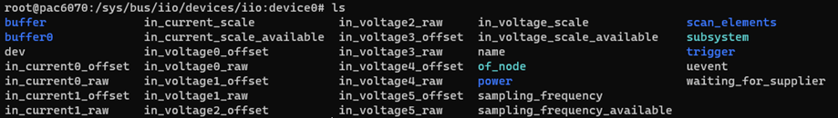
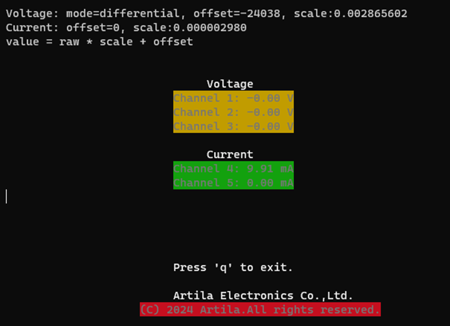

# PAC-6070

## Linux-ready Cortex-A7 Highly Integrated Industrial IoT Gateway
- NXP i.MX6ULL Cortex-A7 CPU, Up to 800MHz
- Support Ubuntu 22.04
- Toolchain: gcc 9.3.0 + glibc 2.31
- 512MB LvDDR3 SDRAM, 16GB eMMC
- 2 x 10/100Mbps Ethernet interface
- 1 x USB OTG port
- 1 x RS-485
- 1 x CAN port, 2 x Digital Input, 2 x Relay out
- 1 x full size miniPCIe socket inside,1 x Micro-SIM slot reserved, Two Antenna holes reserved
- 1 x Micro-SD slot reserved

## Access the USB Serial Console
### USB Serial Console Log-in
User name: root  
Password: root  
Port: /dev/ttymxc0  

Following example by PAC-6070
```
Ubuntu 22.04.4 LTS pac6070 ttymxc0

pac6070 login: root
Password:
Welcome to Ubuntu 22.04.4 LTS (GNU/Linux 6.6.22 armv7l)

 * Documentation:  https://help.ubuntu.com
 * Management:     https://landscape.canonical.com
 * Support:        https://ubuntu.com/pro

This system has been minimized by removing packages and content that are
not required on a system that users do not log into.

To restore this content, you can run the 'unminimize' command.
Last login: Wed Nov 22 04:57:55 CST 2023 on ttymxc0
root@pac6070:~#
```

## Network Settings
### Config the Network Interface
The Cortex-A7 Series based Matrix IoT gateways come two Ethernet ports, the 
default network settings are shown below:  
|Ethernet Type|Port Label|Device mapping|IP mode|IP address|
|---|---|---|---|---|
|10/100Mbit|LAN|eth0|DHCP|auto|
|10/100Mbit|LAN|eth1|static|192.168.2.127|  

Users may need to modify the network settings to meet their LAN environment. The network interface configuration file path is /etc/network/interfaces. Edit and save the configuration file, then use `systemctl restart NetworkManager` command to restart the network interface to activate the network settings.  
```
root@pac6070:~# cat /etc/network/interfaces
# /etc/network/interfaces -- configuration file for ifup(8), ifdown(8)

... ...

auto eth0
    iface eth0 inet dhcp
    #    address 192.168.1.100
    #    netmask 255.255.255.0
    #    network 192.168.1.0
    #    gateway 192.168.1.1

auto eth1
    iface eth1 inet static
        address 192.168.2.127
        netmask 255.255.255.0
        network 192.168.2.0
        gateway 192.168.2.1
        
... ...
```  
Restart the network interface to activate the network settings.  
```
root@pac6070:~# systemctl restart NetworkManager
root@pac6070:~# ifconfig eth0 down && ifconfig eth0 up
root@pac6070:~# ip a show eth0
2: eth0: <BROADCAST,MULTICAST,UP,LOWER_UP> mtu 1500 qdisc pfifo_fast state UP group default qlen 1000
    link/ether 00:13:48:00:00:00 brd ff:ff:ff:ff:ff:ff
    inet 192.168.1.100/24 brd 192.168.1.255 scope global noprefixroute eth0
       valid_lft forever preferred_lft forever
    inet6 fe80::7bea:679b:7e44:3b1b/64 scope link tentative noprefixroute
       valid_lft forever preferred_lft forever
```

### Configure the DNS Server
Use `resolvectl` to set the DNS server.  
`resolvectl dns eth0 8.8.8.8`  

Check the DNS service status.
```
root@pac6070:~# systemctl status systemd-resolved
● systemd-resolved.service - Network Name Resolution
     Loaded: loaded (/lib/systemd/system/systemd-resolved.service; enabled; vend
or preset: enabled)
     Active: active (running) since Wed 2023-11-22 04:57:31 CST; 7 mo
nths 16 days ago
       Docs: man:systemd-resolved.service(8)
             man:org.freedesktop.resolve1(5)
             https://www.freedesktop.org/wiki/Software/systemd/writing-network-c
onfiguration-managers
             https://www.freedesktop.org/wiki/Software/systemd/writing-resolver-
clients
   Main PID: 92 (systemd-resolve)
     Status: "Processing requests..."
        CPU: 3.006s
     CGroup: /system.slice/systemd-resolved.service
             mq92 /lib/systemd/systemd-resolved

Jul 08 15:08:21 pac6070 systemd-resolved[92]:
Using degraded feature set UDP instead of UDP+EDNS0 for DNS server 192.168.1.1
.
Jul 08 16:10:53 pac6070 systemd-resolved[92]: eth0: Bus client set DNS server li
st to: 8.8.8.8
Notice: journal has been rotated since unit was started, output may be incomplet
e.
```
## Access the SSH Console  
Most Linux/OSX computers come with built-in SSH client utility.   For Windows users, it is highly recommended to use **putty** as an SSH client.  
### root account
Default is not allowed to login as root account via SSH in Ubuntu 22.04. To enable the root account login via SSH, modify the **sshd_config** file.  
 - `vi /etc/ssh/sshd_config`, find the line `PermitRootLogin prohibit-password` and change it to `PermitRootLogin yes`.  
 - `systemctl restart sshd` to restart the SSH service.
```
User name: root
Password: root  
```  
Login with root account via SSH.
```
[root@Matrix_034060 ~]#ssh root@192.168.1.103
root@192.168.1.103's password:
Welcome to Ubuntu 22.04.4 LTS (GNU/Linux 6.6.22 armv7l)

 * Documentation:  https://help.ubuntu.com
 * Management:     https://landscape.canonical.com
 * Support:        https://ubuntu.com/pro

This system has been minimized by removing packages and content that are
not required on a system that users do not log into.

To restore this content, you can run the 'unminimize' command.
Last login: Thu Jul  4 11:34:20 2024
root@pac6070:~#
```

## Check Linux Kernel Version
```
root@pac6070:~# uname -a
Linux pac6070 6.6.22 #1 Fri Mar 15 18:25:07 UTC 2024 armv7l armv7l armv7l GNU/Linux
root@pac6070:~# lsb_release -a
No LSB modules are available.
Distributor ID: Ubuntu
Description:    Ubuntu 22.04.4 LTS
Release:        22.04
Codename:       jammy
```  

## File System Information 
The Cortex-A7 Series based Matrix IoT gateways come with 16GB on-board eMMC 
Flash memory, which contains boot loader, Linux kernel, root file system and user 
disk (/home).  
```
root@pac6070:~# lsblk
NAME         MAJ:MIN RM  SIZE RO TYPE MOUNTPOINTS
mmcblk1      179:0    0 14.6G  0 disk
tqmmcblk1p1  179:1    0    2G  0 part
mqmmcblk1p2  179:2    0 12.6G  0 part /
mmcblk1boot0 179:8    0    4M  1 disk
mmcblk1boot1 179:16   0    4M  1 disk
root@pac6070:~# df -h
Filesystem      Size  Used Avail Use% Mounted on
/dev/root        13G  1.1G   11G   9% /
tmpfs           502M     0  502M   0% /dev/shm
tmpfs           201M   21M  180M  11% /run
tmpfs           5.0M     0  5.0M   0% /run/lock
tmpfs           101M     0  101M   0% /run/user/0
root@pac6070:~# ls -F /
bin@   etc/   lib@         mnt/   root/  srv/      tmp/
boot/  gpio/  lost+found/  opt/   run/   swapfile  usr/
dev/   home/  media/       proc/  sbin@  sys/      var/
```

## Serial Port Settings
### Port Mapping 
Port 1 -> /dev/ttymxc1  
### Configure the Serial Port
```
root@pac6070:~# setuart -h
Artila utility: setuart
Usage: setuart [OPTION]

 -h         display this help and exit
 -v         print version number and exit
 -p         uart port number
 -t         uart interface type [232, 485]
 -b         set baud rate, up to 921600bps

Examples:
  setuart -p 1                      display port 1 type and baud rate
  setuart -p 1 -t 485 -b 115200     set port 1 type RS-485 and baud rate to 115200
  setuart -p 1 -t 232 -b 9600       set port 1 type to RS-232 and baud rate to 9600
```
***Caution***  
The serial port’s mode and associated communication parameters will go back to factory default after system reboot.  

## System Time and Real-Time Clock(RTC)
### Adjust System Time by data Command
The Cortex-A7 Series based Matrix IoT gateways support standard date command to adjust the Linux system time manually. A typical usage is: date MMDDhhmmYYYY.
```
root@pac6070:~# date 070909532024
Tue Jul  9 09:53:00 CST 2024
```  
### Adjust RTC by hwclock Command
To adjust the on-board Real-time clock (RTC), please follow the steps shown below: First, to adjust the system time by using the `date` command. Then use the `hwclock` command to synchronize the system time to the RTC.  
A typical usage is: `hwclock -w`.
```
root@pac6070:~# hwclock
2024-07-09 09:57:56.496270+08:00
root@pac6070:~# date
Tue Jul  9 09:57:59 CST 2024
root@pac6070:~# hwclock -w
```  
### Synchronize System Time by NTP Server
#### Install the ntpdate utility
The Cortex-A7 Series based Matrix IoT gateways support the ***ntpdate*** NTP client utility to synchronize the system date with specified NTP server. Users need to install
the ***ntpdate*** utility first by executing the `apt install ntpdate` command.
```
root@pac6070:~# apt install ntpdate -y
Reading package lists... Done
Building dependency tree... Done
Reading state information... Done
The following NEW packages will be installed:
  ntpdate
0 upgraded, 1 newly installed, 0 to remove and 104 not upgraded.
Need to get 47.6 kB of archives.
After this operation, 147 kB of additional disk space will be used.
Get:1 http://ports.ubuntu.com/ubuntu-ports jammy/universe armhf ntpdate armhf 1:4.2.8p15+dfsg-1ubuntu2 [47.6 kB]
Fetched 47.6 kB in 2s (29.2 kB/s)
Selecting previously unselected package ntpdate.
(Reading database ... 25390 files and directories currently installed.)
Preparing to unpack .../ntpdate_1%3a4.2.8p15+dfsg-1ubuntu2_armhf.deb ...
Unpacking ntpdate (1:4.2.8p15+dfsg-1ubuntu2) ...
Setting up ntpdate (1:4.2.8p15+dfsg-1ubuntu2) ...
```
### Using the ntpdate utility
```
root@pac6070:~# date
Tue Jul  9 10:19:32 CST 2024
root@pac6070:~# date 070910202024
Tue Jul  9 10:20:00 CST 2024
root@pac6070:~# ntpdate 0.pool.ntp.org
 9 Jul 10:20:30 ntpdate[27565]: adjust time server 118.163.81.63 offset +0.006714 sec
root@pac6070:~# date
Tue Jul  9 10:20:37 CST 2024
root@pac6070:~# date;hwclock
Tue Jul  9 10:20:44 CST 2024
2024-07-09 10:20:44.221395+08:00
root@pac6070:~# hwclock -w
root@pac6070:~# date;hwclock
Tue Jul  9 10:20:56 CST 2024
2024-07-09 10:20:57.493683+08:00
```

## Insert Kernel Modules
Users can use command `lsmod` to list all installed kernel modules.  
To load additional kernel modules during the system boot-up, you can modify the file: */etc/modules*.  
```
root@pac6070:~# cat /etc/modules
# /etc/modules: kernel modules to load at boot time.
#
# This file contains the names of kernel modules that should be loaded
# at boot time, one per line. Lines beginning with "#" are ignored.
```

## Insert Software Package

## Mount/Unmount an SD Card
The Cortex-A7 Series based Matrix IoT gateways support SD card access. If an SD card is inserted, you can use lsblk command to find the device identifier name. And then use mount command to mount the SD card to a folder.  

Before SD Insertion
```
root@pac6070:~# lsblk
NAME         MAJ:MIN RM  SIZE RO TYPE MOUNTPOINTS
mmcblk1      179:0    0 14.6G  0 disk
`-mmcblk1p1  179:1    0    2G  0 part
 -mmcblk1p2  179:2    0 12.6G  0 part /
mmcblk1boot0 179:8    0    4M  1 disk
mmcblk1boot1 179:16   0    4M  1 disk
```  
After SD Insertion
```
root@pac6070:~# lsblk
NAME         MAJ:MIN RM  SIZE RO TYPE MOUNTPOINTS
mmcblk1      179:0    0 14.6G  0 disk
`-mmcblk1p1  179:1    0    2G  0 part
 -mmcblk1p2  179:2    0 12.6G  0 part /
mmcblk1boot0 179:8    0    4M  1 disk
mmcblk1boot1 179:16   0    4M  1 disk
mmcblk0      179:24   0  7.3G  0 disk
`-mmcblk0p1  179:25   0  7.3G  0 part
```  
Mount mmcblk1 to /media.  
```
root@pac6070:~# mount /dev/mmcblk0p1 /media/
root@pac6070:~# lsblk
NAME         MAJ:MIN RM  SIZE RO TYPE MOUNTPOINTS
mmcblk1      179:0    0 14.6G  0 disk
`-mmcblk1p1  179:1    0    2G  0 part
 -mmcblk1p2  179:2    0 12.6G  0 part /
mmcblk1boot0 179:8    0    4M  1 disk
mmcblk1boot1 179:16   0    4M  1 disk
mmcblk0      179:24   0  7.3G  0 disk
`-mmcblk0p1  179:25   0  7.3G  0 part /media
```  
Unmount /media.
```
root@pac6070:~# umount /media/
```  

## Web Server Settings

## PHP Support

## Reboot the System
To re-boot the system, use the `reboot` command.  

## DIO
- Digital Output x 8
- Digital Input x 8
```
root@pac6070:~# ls /gpio/
DI1  DI3  DI5  DI7  DO1  DO3  DO5  DO7  pciepower
DI2  DI4  DI6  DI8  DO2  DO4  DO6  DO8
```  
Example 1, Read value of DI1  
`cat /gpio/DI1/value`  

Example 2, Set High of DO1  
`echo 0 > /gpio/DO1/value`  
### Website  
Visit the website hosted on the PAC-6070 using a web browser.  

Login  
- account: admin
- password: admin  

  

### Dashboard
  


## Setup SIM card
### PCIE Power
PCIE power value is 1 means power on, 0 means power off.
```
root@pac6070:~# cat /gpio/pciepower/value
1
```  
Power off the PCIE slot.  
```
echo 0 > /gpio/pciepower/value  
```

PAC-6070 support the miniPCIe slot can be install LTE/4G module for communication.
SIM Card setting is necessary before access by following:  
==***NOTICE***==: Please unlock SIM PIN code first  
Example: SIM7100E  
`apt install -y kernel-module-option kernel-module-qmi-wwan kernel-module-cdc-wdm kernel-module-usbnet libqmi-utils`  
`apt install usbutils -y`  
`apt install picocom -y`
```
root@pac6070:~# usb-devices

T:  Bus=01 Lev=00 Prnt=00 Port=00 Cnt=00 Dev#=  1 Spd=480 MxCh= 1
D:  Ver= 2.00 Cls=09(hub  ) Sub=00 Prot=01 MxPS=64 #Cfgs=  1
P:  Vendor=1d6b ProdID=0002 Rev=06.06
S:  Manufacturer=Linux 6.6.22 ehci_hcd
S:  Product=EHCI Host Controller
S:  SerialNumber=ci_hdrc.0
C:  #Ifs= 1 Cfg#= 1 Atr=e0 MxPwr=0mA
I:  If#= 0 Alt= 0 #EPs= 1 Cls=09(hub  ) Sub=00 Prot=00 Driver=hub
E:  Ad=81(I) Atr=03(Int.) MxPS=   4 Ivl=256ms

T:  Bus=02 Lev=00 Prnt=00 Port=00 Cnt=00 Dev#=  1 Spd=480 MxCh= 1
D:  Ver= 2.00 Cls=09(hub  ) Sub=00 Prot=01 MxPS=64 #Cfgs=  1
P:  Vendor=1d6b ProdID=0002 Rev=06.06
S:  Manufacturer=Linux 6.6.22 ehci_hcd
S:  Product=EHCI Host Controller
S:  SerialNumber=ci_hdrc.1
C:  #Ifs= 1 Cfg#= 1 Atr=e0 MxPwr=0mA
I:  If#= 0 Alt= 0 #EPs= 1 Cls=09(hub  ) Sub=00 Prot=00 Driver=hub
E:  Ad=81(I) Atr=03(Int.) MxPS=   4 Ivl=256ms

T:  Bus=02 Lev=01 Prnt=01 Port=00 Cnt=01 Dev#=  2 Spd=480 MxCh= 0
D:  Ver= 2.00 Cls=00(>ifc ) Sub=00 Prot=00 MxPS=64 #Cfgs=  2
P:  Vendor=1e0e ProdID=9001 Rev=02.32
S:  Manufacturer=SimTech, Incorporated
S:  Product=SimTech, Incorporated
S:  SerialNumber=0123456789ABCDEF
C:  #Ifs= 7 Cfg#= 1 Atr=80 MxPwr=500mA
I:  If#= 0 Alt= 0 #EPs= 2 Cls=ff(vend.) Sub=ff Prot=ff Driver=(none)
E:  Ad=01(O) Atr=02(Bulk) MxPS= 512 Ivl=0ms
E:  Ad=81(I) Atr=02(Bulk) MxPS= 512 Ivl=0ms
I:  If#= 1 Alt= 0 #EPs= 3 Cls=ff(vend.) Sub=00 Prot=00 Driver=(none)
E:  Ad=02(O) Atr=02(Bulk) MxPS= 512 Ivl=0ms
E:  Ad=82(I) Atr=02(Bulk) MxPS= 512 Ivl=0ms
E:  Ad=83(I) Atr=03(Int.) MxPS=  10 Ivl=32ms
I:  If#= 2 Alt= 0 #EPs= 3 Cls=ff(vend.) Sub=00 Prot=00 Driver=(none)
E:  Ad=03(O) Atr=02(Bulk) MxPS= 512 Ivl=0ms
E:  Ad=84(I) Atr=02(Bulk) MxPS= 512 Ivl=0ms
E:  Ad=85(I) Atr=03(Int.) MxPS=  10 Ivl=32ms
I:  If#= 3 Alt= 0 #EPs= 3 Cls=ff(vend.) Sub=00 Prot=00 Driver=(none)
E:  Ad=04(O) Atr=02(Bulk) MxPS= 512 Ivl=0ms
E:  Ad=86(I) Atr=02(Bulk) MxPS= 512 Ivl=0ms
E:  Ad=87(I) Atr=03(Int.) MxPS=  10 Ivl=32ms
I:  If#= 4 Alt= 0 #EPs= 3 Cls=ff(vend.) Sub=00 Prot=00 Driver=(none)
E:  Ad=05(O) Atr=02(Bulk) MxPS= 512 Ivl=0ms
E:  Ad=88(I) Atr=02(Bulk) MxPS= 512 Ivl=0ms
E:  Ad=89(I) Atr=03(Int.) MxPS=  10 Ivl=32ms
I:  If#= 5 Alt= 0 #EPs= 3 Cls=ff(vend.) Sub=ff Prot=ff Driver=(none)
E:  Ad=06(O) Atr=02(Bulk) MxPS= 512 Ivl=0ms
E:  Ad=8a(I) Atr=02(Bulk) MxPS= 512 Ivl=0ms
E:  Ad=8b(I) Atr=03(Int.) MxPS=   8 Ivl=32ms
I:  If#= 6 Alt= 0 #EPs= 2 Cls=ff(vend.) Sub=42 Prot=01 Driver=(none)
E:  Ad=07(O) Atr=02(Bulk) MxPS= 512 Ivl=0ms
E:  Ad=8c(I) Atr=02(Bulk) MxPS= 512 Ivl=0ms
```  
```
root@pac6070:~# lsusb
Bus 002 Device 002: ID 1e0e:9001 Qualcomm / Option SimTech, Incorporated
Bus 002 Device 001: ID 1d6b:0002 Linux Foundation 2.0 root hub
Bus 001 Device 001: ID 1d6b:0002 Linux Foundation 2.0 root hub
```  
```
root@pac6070:~# mmcli -L
    /org/freedesktop/ModemManager1/Modem/0 [QUALCOMM INCORPORATED] 0
root@pac6070:~# mmcli -m 0
  ----------------------------------
  General  |                   path: /org/freedesktop/ModemManager1/Modem/0
           |              device id: a7f45606e1fd59c56e6e1d64bf0e145bcf421214
  ----------------------------------
  Hardware |           manufacturer: QUALCOMM INCORPORATED
           |                  model: 0
           |      firmware revision: M9615A-CETWTBZM-6.0.15255  1  [Mar 04 2015 07:00:00]
           |           h/w revision: 30000
           |              supported: gsm-umts, lte
           |                current: gsm-umts, lte
           |           equipment id: 866802020119147
  ----------------------------------
  System   |                 device: /sys/devices/platform/soc/2100000.bus/2184200.usb/ci_hdrc.1/usb2/2-1
           |                drivers: qmi_wwan, option
           |                 plugin: simtech
           |           primary port: cdc-wdm0
           |                  ports: cdc-wdm0 (qmi), ttyUSB0 (ignored), ttyUSB1 (gps),
           |                         ttyUSB2 (at), ttyUSB3 (at), ttyUSB4 (audio), wwan0 (net)
  ----------------------------------
  Status   |                   lock: sim-pin2
           |         unlock retries: sim-pin (3), sim-puk (10), sim-pin2 (3), sim-puk2 (10)
           |                  state: searching
           |            power state: on
           |         signal quality: 33% (recent)
  ----------------------------------
  Modes    |              supported: allowed: 2g; preferred: none
           |                         allowed: 3g; preferred: none
           |                         allowed: 4g; preferred: none
           |                         allowed: 2g, 3g; preferred: 3g
           |                         allowed: 2g, 3g; preferred: 2g
           |                         allowed: 2g, 4g; preferred: 4g
           |                         allowed: 2g, 4g; preferred: 2g
           |                         allowed: 3g, 4g; preferred: 4g
           |                         allowed: 3g, 4g; preferred: 3g
           |                         allowed: 2g, 3g, 4g; preferred: 4g
           |                         allowed: 2g, 3g, 4g; preferred: 3g
           |                         allowed: 2g, 3g, 4g; preferred: 2g
           |                current: allowed: 2g, 3g, 4g; preferred: 4g
  ----------------------------------
  Bands    |              supported: egsm, dcs, utran-1, utran-3, utran-5, utran-8, eutran-1,
           |                         eutran-3, eutran-7, eutran-8, eutran-20, eutran-38, eutran-40
           |                current: egsm, dcs, utran-1, utran-8, eutran-1, eutran-3, eutran-7,
           |                         eutran-8, eutran-20, eutran-38, eutran-40
  ----------------------------------
  IP       |              supported: ipv4, ipv6, ipv4v6
  ----------------------------------
  3GPP     |                   imei: 866802020119147
           |          enabled locks: fixed-dialing
           |           registration: searching
           |   packet service state: detached
  ----------------------------------
  3GPP EPS |   ue mode of operation: csps-2
           | initial bearer ip type: ipv4v6
  ----------------------------------
  SIM      |       primary sim path: /org/freedesktop/ModemManager1/SIM/0
  ```  
  ```
  root@pac6070:~# picocom /dev/ttyUSB2
picocom v3.1

port is        : /dev/ttyUSB2
flowcontrol    : none
baudrate is    : 9600
parity is      : none
databits are   : 8
stopbits are   : 1
escape is      : C-a
local echo is  : no
noinit is      : no
noreset is     : no
hangup is      : no
nolock is      : no
send_cmd is    : sz -vv
receive_cmd is : rz -vv -E
imap is        :
omap is        :
emap is        : crcrlf,delbs,
logfile is     : none
initstring     : none
exit_after is  : not set
exit is        : no

Type [C-a] [C-h] to see available commands
Terminal ready

*** local echo: yes ***
AT+CPIN?

+CPIN: READY

OK

Terminating...
Skipping tty reset...
Thanks for using picocom
```


## Setup analog input
### iio Path  
/sys/bus/iio/devices/iio:device0/  
  

### Formula  
raw * scale + offset
```
root@pac6070:/sys/bus/iio/devices/iio:device0# cat in_voltage0-voltage1_raw
8387948
root@pac6070:/sys/bus/iio/devices/iio:device0# cat in_voltage0-voltage1_offset
-24038
root@pac6070:/sys/bus/iio/devices/iio:device0# cat in_voltage-voltage_scale
0.002865602
```
### Mode  
- Single-end=0
- Differential=1
```
root@pac6070:~# cat /etc/modprobe.d/ad4111.conf
options ad4111 differential=1
```
reboot after modify the config file    

### Overview  
`iio_info`
```
root@pac6070:~# iio_info
Library version: 0.23 (git tag: v0.23)
Compiled with backends: local xml ip usb
IIO context created with local backend.
Backend version: 0.23 (git tag: v0.23)
Backend description string: Linux pac6070 6.6.22 #1 Fri Mar 15 18:25:07 UTC 2024 armv7l
IIO context has 2 attributes:
        local,kernel: 6.6.22
        uri: local:
IIO context has 2 devices:
        iio:device0: ad4111 (buffer capable)
                5 channels found:
                        voltage0-voltage1:  (input, index: 0, format: be:u24/32>>0)
                        4 channel-specific attributes found:
                                attr  0: offset value: -24038
                                attr  1: raw value: 8387952
                                attr  2: scale value: 0.002865602
                                attr  3: scale_available value: 0.000000000
                        voltage2-voltage3:  (input, index: 1, format: be:u24/32>>0)
                        4 channel-specific attributes found:
                                attr  0: offset value: -24038
                                attr  1: raw value: 8387864
                                attr  2: scale value: 0.002865602
                                attr  3: scale_available value: 0.000000000
                        voltage4-voltage5:  (input, index: 2, format: be:u24/32>>0)
                        4 channel-specific attributes found:
                                attr  0: offset value: -24038
                                attr  1: raw value: 8387186
                                attr  2: scale value: 0.002865602
                                attr  3: scale_available value: 0.000000000
                        current0:  (input, index: 3, format: be:u24/32>>0)
                        4 channel-specific attributes found:
                                attr  0: offset value: 0
                                attr  1: raw value: 0
                                attr  2: scale value: 0.000002980
                                attr  3: scale_available value: 0.000000000
                        current1:  (input, index: 4, format: be:u24/32>>0)
                        4 channel-specific attributes found:
                                attr  0: offset value: 0
                                attr  1: raw value: 0
                                attr  2: scale value: 0.000002980
                                attr  3: scale_available value: 0.000000000
                3 device-specific attributes found:
                                attr  0: sampling_frequency value: 31250
                                attr  1: sampling_frequency_available value: 31250 31250 31250 31250 31250 31250 15625 10417 5208
                                attr  2: waiting_for_supplier value: 0
                3 buffer-specific attributes found:
                                attr  0: data_available value: 0
                                attr  1: direction value: in
                                attr  2: watermark value: 1
                Current trigger: trigger0(ad4111-dev0)
        trigger0: ad4111-dev0
                0 channels found:
                No trigger on this device
``` 

### Display - CLI  
`lsadc`  


### Website  
Visit the website hosted on the PAC-6070 using a web browser.  

Login  
- account: admin
- password: admin  

  

### Dashboard
  